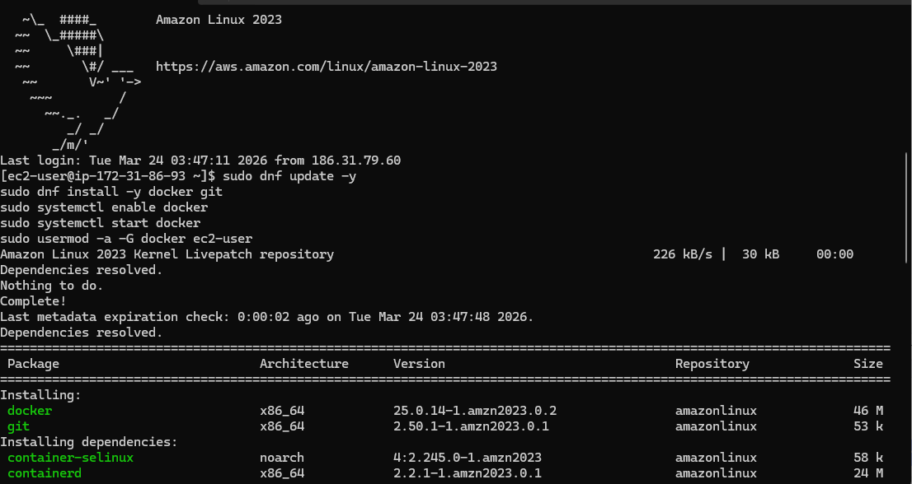
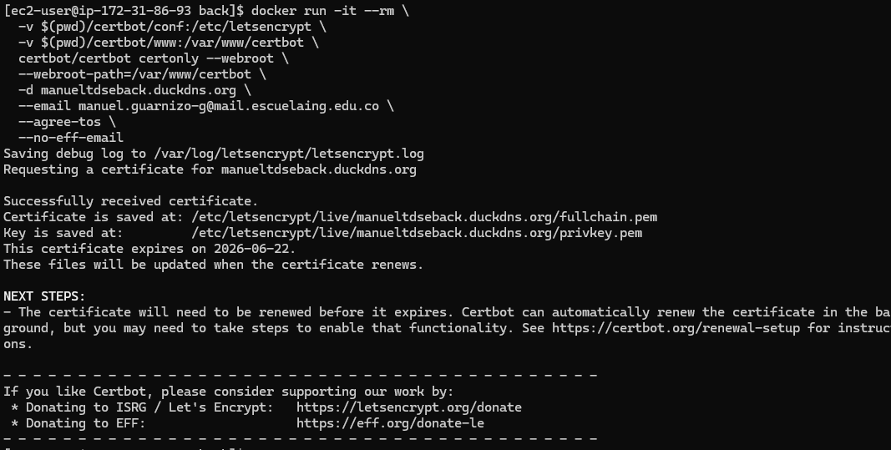
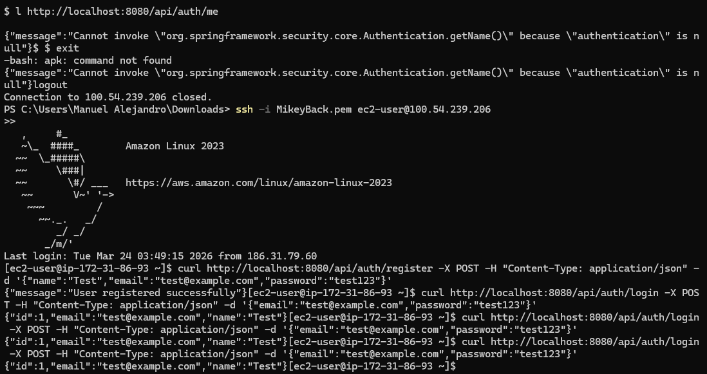
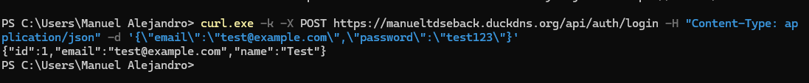
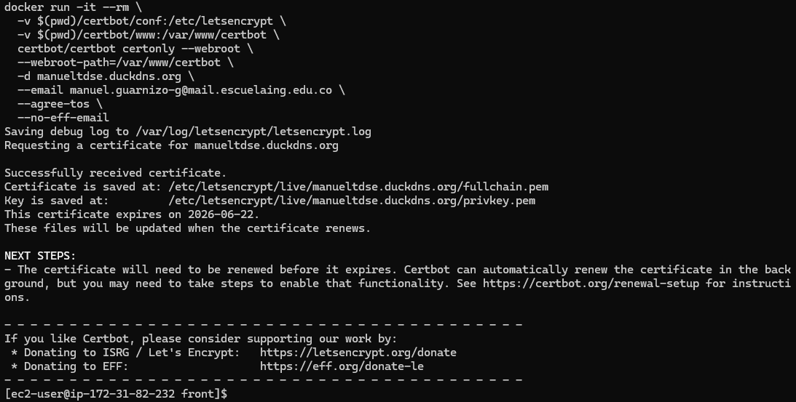
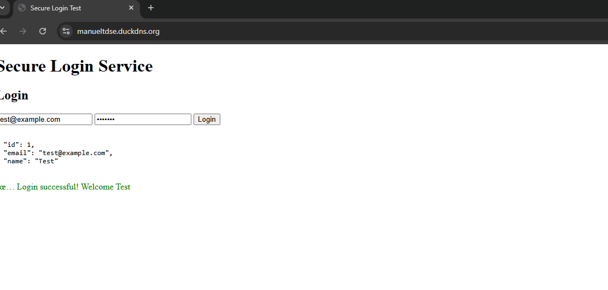
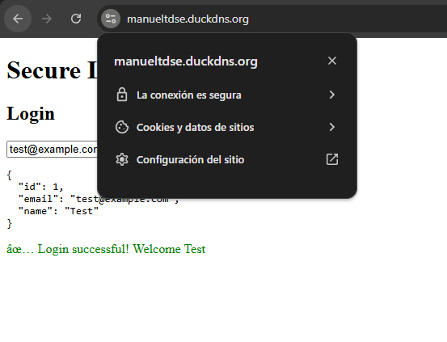
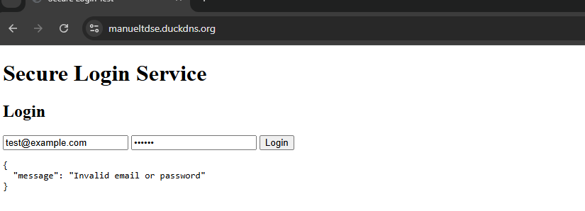

# Secure AWS Login Service

This repository contains a secure login service with separate frontend and backend deployed on AWS EC2 with HTTPS.

## Architecture

- **Frontend**: Apache HTTP Server on EC2 (securitytdse.duckdns.org)
- **Backend**: Spring Boot + PostgreSQL on EC2 (securitytdseback.duckdns.org)
- **HTTPS**: Let's Encrypt certificates
- **Authentication**: Session-based (no JWT)

## Deployment Instructions

### Prerequisites

- 2 AWS EC2 instances (Amazon Linux)
- Security Group inbound rules: 22, 80, 443
- Domains pointed to EC2 public IPs:
    - Frontend: manueltdse.duckdns.org
    - Backend: manueltdseback.duckdns.org
- SSH key for both instances

### 1) Deploy Backend (API Server)

bash
ssh -i your-key.pem ec2-user@BACKEND_EC2_IP
git clone https://github.com/juancontrerasp/AWS_Login_Service-TDSE.git
cd AWS_Login_Service-TDSE/back
chmod +x init-certbot.sh
./init-certbot.sh
docker compose up -d --build
docker compose ps

Empezar las instancias

### ejecutar los certbot

## Ya quedo el back

obtener certificado para el front

asi ya podemos probar el login en la del front
quedando asi:
 aqui vemos cuando acepta

aca la conexion es segura

y aca vemos cuando rechaza
